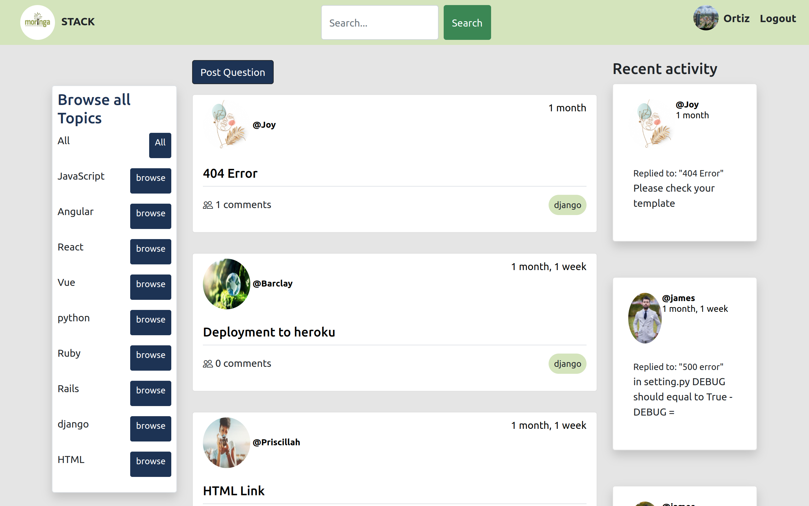

# MORINGA-STACK

#### By Wayne Musungu, Edah Chepngetich, Victor Makori, Haimana Uta, Clinton Wambungu and James Musembi


## Table of Content

- [Description](#Description)
- [Installation Requirement](#Installation)
- [Technologies Used](#Technologies-Used)
- [Reference](#Reference)
- [Licence](#LICENSE)
- [Authors Info](#Author-Info)

## Description

Moringa-stack allows the user to post a question in any programming language and view on a different page different response on how to solve the error.
All registered users are able to post a question and comment on any question that might help other user with an error



<!--#### Livelink
https://moringastack.herokuapp.com/  -->


#### Technologies used
    - Python 3.8
    - HTML
    - CSS
    - Bootstrap 5
    - Heroku
    - Postgresql
    - Django, Django Rest Framework

[Go Back to the top](#MORINGA-STACK)

# Installation

### Requirements

Either a computer,phone,tablet or an Ipad
Make sure you have access to internet
Click on the live link in the about section

#### Install dependancies
Install dependancies that will create an environment for the app to run
`pip install -r requirements.txt`

#### Create the Database
In a new terminal, open the postgresql shell with `psql`.
```bash
CREATE DATABASE moringastackers;
```

#### Make and run migrations
```bash
python3.8 manage.py makemigrations && python3.8 manage.py migrate
```

#### Run the app
```bash
python3.8 manage.py runserver
```
Open [localhost:8000](http://127.0.0.1:8000/)

<!-- ## Running the tests

Run test using the following command -->

<!-- 
```
 ./manage.py test dflp84r64errsj
``` -->

[Go Back to the top](#MORINGA-STACK)


##### Link to Live Site

# License

Copyright (c) 2022 WayneMusungu

Permission is hereby granted, free of charge, to any person obtaining a copy
of this software and associated documentation files (the "Software"), to deal
in the Software without restriction, including without limitation the rights
to use, copy, modify, merge, publish, distribute, sublicense, and/or sell
copies of the Software, and to permit persons to whom the Software is
furnished to do so, subject to the following conditions:

The above copyright notice and this permission notice shall be included in all
copies or substantial portions of the Software.

THE SOFTWARE IS PROVIDED "AS IS", WITHOUT WARRANTY OF ANY KIND, EXPRESS OR
IMPLIED, INCLUDING BUT NOT LIMITED TO THE WARRANTIES OF MERCHANTABILITY,
FITNESS FOR A PARTICULAR PURPOSE AND NONINFRINGEMENT. IN NO EVENT SHALL THE
AUTHORS OR COPYRIGHT HOLDERS BE LIABLE FOR ANY CLAIM, DAMAGES OR OTHER
LIABILITY, WHETHER IN AN ACTION OF CONTRACT, TORT OR OTHERWISE, ARISING FROM,
OUT OF OR IN CONNECTION WITH THE SOFTWARE OR THE USE OR OTHER DEALINGS IN THE
SOFTWARE.


## Authors Info

* **Wayne Musungu** - [WayneMusungu](https://github.com/WayneMusungu)

* **Clinton Wambugu** - [Clinton-dev](https://github.com/Clinton-dev)

* **Edah Chepngetich** - [edah-hub](https://github.com/edah-hub)

* **James Musembi** - [JamesMusembi](https://github.com/JamesMusembi)

* **Victor Ondari** - [Victor Ondari](https://github.com/Vonmak)

* **Haimana Uta** - [haimy254](https://github.com/haimy254)


[Go Back to the top](#MORINGA-STACK)
